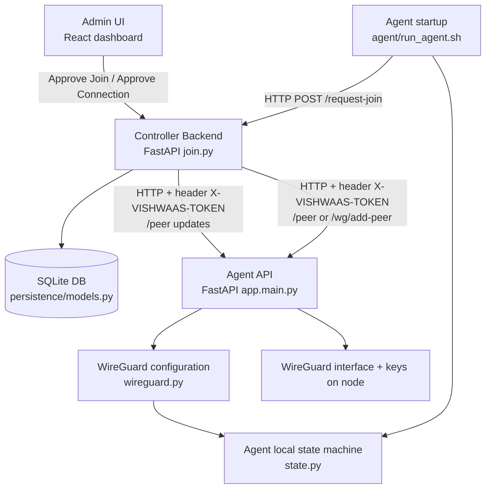

# VISHWAAS

> A WireGuard VPN system with an explicit agent join/connect workflow that is centrally approved by a controller.

## 🧠 What This Project Does (Plain English)
VISHWAAS helps you build a private VPN between multiple Linux machines without manually editing WireGuard config on every device. Each machine runs an “agent” that requests access to join the VPN. A central “controller” provides a dashboard where an administrator approves join requests and approves connections between machines. After approval, the controller pushes the required configuration to the agent(s), which brings up and manages the WireGuard interface. The result is a controlled, auditable VPN setup where “nothing becomes active” without explicit approval.

## 🤖 LLM/Agent Quick-Orientation

- **Project type**: API service + dashboard + distributed node agents
- **Primary language & runtime**: Python (controller + agent, FastAPI/uvicorn) and JavaScript/TypeScript (frontend dashboard)
- **Core framework(s)**: FastAPI, SQLAlchemy, pydantic-settings, httpx, React + Vite
- **LLM(s) used**: None ([FILL IN] if you later add an LLM-based assistant)
- **Entry point**:
  - Controller: `controller/run_controller.sh` (runs `controller/backend/app/main.py` via uvicorn and `controller/frontend`)
  - Agent: `agent/run_agent.sh` (runs `agent/app/main.py` via uvicorn)
- **Key design pattern**: “Approval gate” workflow with strict state transitions (PENDING -> APPROVED -> ACTIVE, and REQUESTED -> APPROVED -> ACTIVE)
- **State management**:
  - Controller persistent state stored in SQLite (nodes, connection requests, audit logs)
  - Agent runtime state stored in memory (plus WireGuard/TPM key state on the node)
- **External dependencies**:
  - WireGuard tooling (`wireguard-tools`, `ip`, and related commands)
  - Optional: TPM tooling (`tpm2-tools`) when `use_tpm_wg_key=true`
  - Optional: SSH for deployment scripts (`deploy-agent-to-clone.sh`)

## 🏗️ Architecture Overview

### Diagram (Mermaid)


### Component Table
| Component | Role | File/Module | Notes |
|----------|------|--------------|-------|
| Controller API | Exposes REST endpoints for join/connection approval | `controller/backend/app/api/routes/*.py` | Routes: `join.py`, `nodes.py`, `connections.py`, `monitoring.py` |
| Controller Services | Implements approval logic and agent callbacks | `controller/backend/app/services/*.py` | Key modules: `join_service.py`, `connection_service.py`, `agent_client.py` |
| Controller Persistence | Stores nodes/requests/logs in SQLite | `controller/backend/app/persistence/*.py` | Key modules: `database.py`, `models.py` |
| Domain Enums | Defines strict state transitions | `controller/backend/app/domain/*.py` | Key module: `enums.py` |
| Controller Core Config | Loads controller settings from env | `controller/backend/app/core/config.py` | Key var: `VISHWAAS_AGENT_TOKEN` -> `agent_token` |
| Frontend Dashboard | UI to approve joins/connections and view status | `controller/frontend/src/...` | UI pages drive controller REST API calls |
| Agent Config Loader | Loads + validates `agent_config.json` | `agent/app/config.py` | Adds clear errors: “Please enter correct details in agent_config.json” |
| Agent API | Handles join loop and receives controller peer updates | `agent/app/main.py` | Starts join process; exposes controller-compatible endpoints |
| Agent Security | Token checks for controller->agent calls | `agent/app/security.py` | Join requests are tokenless; peer changes require token |
| Agent WireGuard Manager | Creates keys and brings up/down WireGuard | `agent/app/wireguard.py` | Interface name and keys directory come from config |
| Agent TPM Support (optional) | Stores/reads private keys in TPM NV index | `agent/app/tpm.py` | Enabled via `use_tpm_wg_key` |
| Agent Run/Install Scripts | Local developer run and systemd deployment | `agent/run_agent.sh`, `agent/install.sh` | Run validates config before starting |

## 📁 Project Structure

The repository is split into two deployable units. On a machine that is the controller, deploy `controller/`. On a node that should join the VPN, deploy `agent/`.

```text
vishwaas/
├── controller/                     # Control plane: API + dashboard
│   ├── backend/                    # FastAPI backend (controller)
│   │   └── app/
│   │       ├── api/routes/
│   │       ├── core/config.py
│   │       ├── services/
│   │       ├── persistence/
│   │       └── domain/
│   ├── frontend/                   # React/Vite dashboard
│   ├── run_controller.sh          # Starts backend + frontend and logs
│   ├── capture_log.sh             # Archives controller and agent logs (best-effort)
│   └── logs/                      # Runtime logs for controller runs
│
├── agent/                          # Node software: registers + configures WireGuard
│   ├── app/                        # Agent implementation
│   │   ├── main.py                # Startup/join loop and HTTP endpoints
│   │   ├── config.py              # agent_config.json loader + validation
│   │   ├── security.py            # token checks for controller callbacks
│   │   ├── wireguard.py           # WireGuard operations
│   │   └── tpm.py                 # optional TPM integration
│   ├── run_agent.sh                # Validates config, then starts uvicorn on :9000
│   ├── install.sh                  # Installs as systemd service
│   ├── uninstall.sh                # Uninstalls service and app folder
│   ├── deploy-agent-to-clone.sh   # Deploy the agent folder to a remote node
│   ├── agent_config.json.example  # Template config (no secrets)
│   └── tpm_scripts/               # Helper scripts for TPM provisioning (best-effort)
│
├── DESIGN.md                       # Join/approval/key-management design
├── RUN.md                          # Practical run instructions (high level)
└── .gitignore
```

## Setup & Prerequisites

### Controller machine requirements
- Linux machine reachable by agents (IP:8000 on the controller)
- Python + build tools (used to install backend deps)
- Node.js + npm (used to install frontend deps)
- Environment variable `VISHWAAS_AGENT_TOKEN` set in `controller/backend/.env`

### Agent machine requirements
- Linux (Ubuntu-based recommended)
- WireGuard installed: `sudo apt install wireguard-tools`
- Root access for installation and to manage WireGuard interface
- Agent config file: `agent/agent_config.json` created from the example
- Optional TPM: TPM 2.0 device and `tpm2-tools` if `use_tpm_wg_key=true`

## Configuration

### Controller configuration (`controller/backend/.env`)
The backend loads settings from `.env` using prefix `VISHWAAS_`.

- `VISHWAAS_AGENT_TOKEN` (required for controller->agent callbacks)

Debug behavior: if this token is missing/empty, the controller logs a warning at startup and cannot push peer updates reliably.

### Agent configuration (`agent/agent_config.json`)
The agent expects a JSON object with (at minimum):
- `master_url`: Controller base URL (e.g. `http://192.168.10.15:8000`)
- `master_token`: Shared token that must match controller `VISHWAAS_AGENT_TOKEN`
- `agent_advertise_url`: URL controller uses to reach this agent (e.g. `http://192.168.10.16:9000`)

The agent also supports:
- `node_name`: `"auto"` or a string
- `wg_interface`: WireGuard interface name (default `wg0`)
- `listen_port`: WireGuard listen port (default `51820`)
- `subnet`: VPN subnet (default `10.10.10.0/24`)
- `keys_dir`: where keys are stored (default `./keys`)
- `use_tpm_wg_key`: optional TPM-based key storage
- `tpm_nv_index_wg`: TPM NV index (default `1`)

## Running the System

### Run controller (developer mode)
```bash
cd controller
./run_controller.sh
```

Expected services:
- Backend API: `http://0.0.0.0:8000`
- Dashboard UI: `http://localhost:3000`
- Logs: `controller/logs/backend.log` and `controller/logs/frontend.log`

### Run agent
```bash
cd agent
sudo ./run_agent.sh
```

Expected service:
- Agent API on `:9000` (controller can reach it via `agent_advertise_url`)

## Joining the VPN (Operational Flow)

1. Agent starts and sends a join request to the controller: `POST /request-join`
2. In the controller UI:
   - Approve the join request (controller assigns a VPN IP and pushes config)
3. Agent applies WireGuard configuration and brings up the interface.
4. To connect two nodes:
   - Create a connection request and approve it
   - Controller adds each node as a peer on the other.

Key point: No node becomes ACTIVE and no connection is created without approval.

## Debugging & Validation Messages

### Agent config errors
If `agent/agent_config.json` is missing or invalid, `agent/run_agent.sh` exits early with:
- `ERROR: agent_config.json not found...` OR
- `ERROR: agent_config.json is not valid JSON...` OR
- `ERROR: Please enter correct details in agent_config.json:` followed by a list of specific issues.

This is intentionally designed so both developers and non-technical operators can quickly correct the config.

### Controller missing token
If `VISHWAAS_AGENT_TOKEN` is missing/empty, controller backend logs a warning. Peer updates from the controller to the agent will fail or be unauthorized.

### Capture logs
To archive logs from a controller run (and agent logs when present):
```bash
cd controller
./capture_log.sh
```

It creates a timestamped tarball under `controller/logs/`.

## Security Model

1. **Central authority**: only the controller approves joins and connection creation.
2. **Token-gated peer management**:
   - Join requests from agents are tokenless (controller gates approve/reject).
   - Controller->agent endpoints require `X-VISHWAAS-TOKEN`.
3. **Private keys**:
   - Agents generate keys locally by default.
   - Optional: agents can store the WireGuard private key in TPM NV storage when `use_tpm_wg_key=true`.

## Extensibility Notes
- The controller backend uses a service layer (approval logic) separated from API routes, making it easy to add new approval steps and audit events.
- The agent’s key storage approach is configurable:
  - agent-generated keys (default)
  - controller-issued keys (`controller_issues_keys=true`) [FILL IN: docs/implementation details]
  - TPM-bound storage (`use_tpm_wg_key=true`)

## [FILL IN] Known Limitations
- [FILL IN]

## [FILL IN] License
- [FILL IN]
